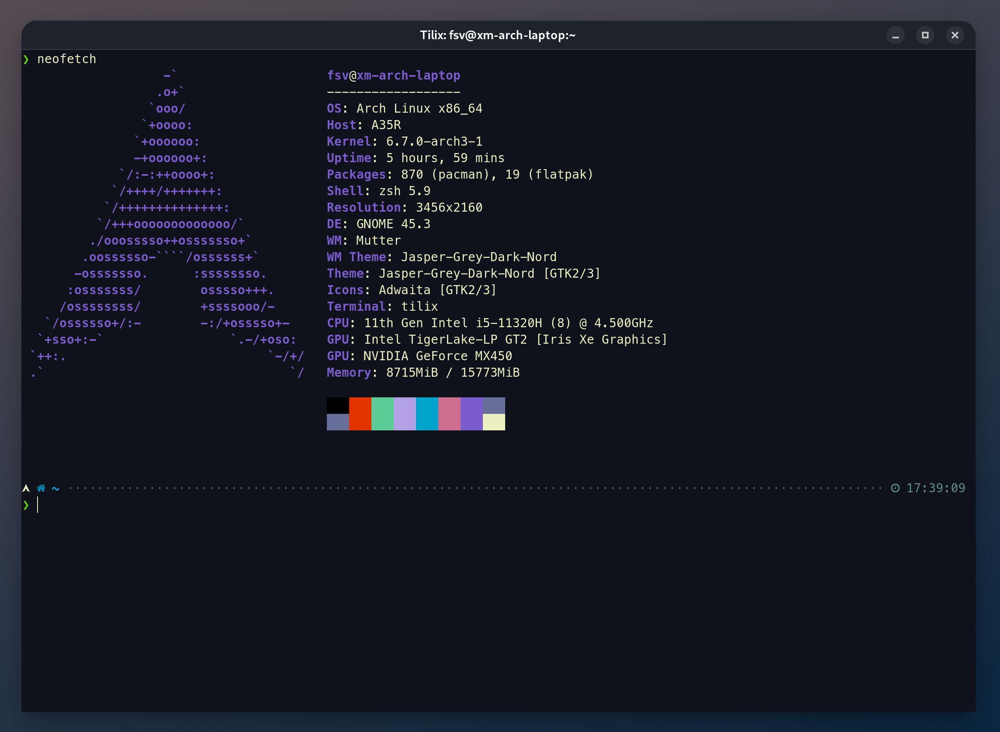
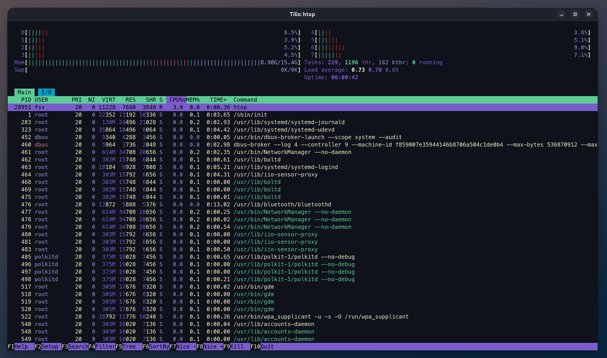

# SPACEDUCK-TILIX THEME

A theme for Tilix, inspired by [Spaceduck for Vim project](https://github.com/pineapplegiant/spaceduck).
Color codes are taken from the project above.

 

 

## Install
1. Download `spaceduck.json` into `~/.config/tilix/schemes/spaceduck.json`.
2. Open: Tilix -> Preferences -> Profiles -> default -> Color -> Color scheme -> choose `Spaceduck`.
